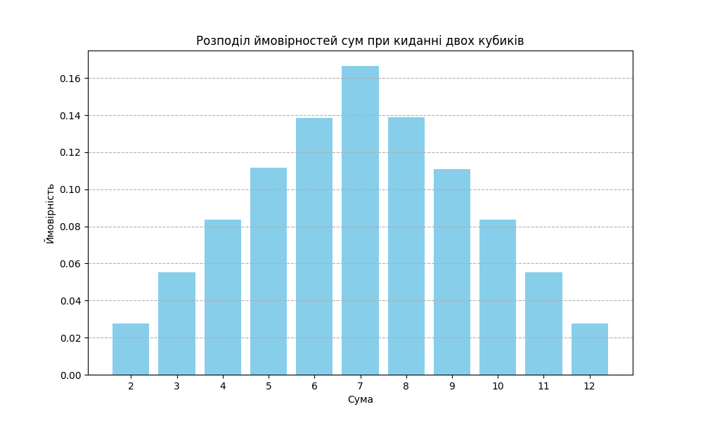

# Завдання 7. Використання методу Монте-Карло

## Опис

Порівняння отриманіх за допомогою методу Монте-Карло результати з аналітичними розрахунками

## Результати 

| Сума |   Монте-Карло (%) |   Аналітична ймовірність (%) |
|-------:|------------------:|-----------------------------:|
|      2 |            2.7644 |                         2.78 |
|      3 |            5.5239 |                         5.56 |
|      4 |            8.3635 |                         8.33 |
|      5 |           11.1715 |                        11.11 |
|      6 |           13.8725 |                        13.89 |
|      7 |           16.6554 |                        16.67 |
|      8 |           13.8963 |                        13.89 |
|      9 |           11.089  |                        11.11 |
|     10 |            8.3518 |                         8.33 |
|     11 |            5.533  |                         5.56 |
|     12 |            2.7787 |                         2.78 |

## Висновки

1. **Відхилення**:
   - Всі отримані методом Монте-Карло результати знаходяться дуже близько до аналітичних значень, що свідчить про високу точність розрахунків.
   - Максимальне відхилення між ймовірностями становить близько 0.03% – це значення є досить малим і може бути пов’язане з випадковістю вибірки, що використовується в методі Монте-Карло.

2. **Стабільність**:
   - Ймовірності для найімовірніших сум, таких як 7 (16.6554% проти 16.67%) та 6 (13.8725% проти 13.89%), показують особливо точні збіги.
   - Відхилення в малоймовірних сум, таких як 2 та 12, також мінімальні, що підтверджує правильність реалізації симуляції.

3. **Висновок**:
   - Результати, отримані за допомогою методу Монте-Карло, добре співпадають з аналітичними ймовірностями, що демонструє правильність і точність симуляції.
   - Даний метод можна використовувати для моделювання і оцінки ймовірностей подібних стохастичних процесів.

